# Chartarium Wars

Descripción del juego: un juego de tanques estilo papel donde peleas contra un rival. Recoge poderes para desatar el caos y dejar sin escapatoria al oponente.

Integrantes del equipo:

* Iván Palacios Martín, [i.palacios.2023@alumnos.urjc.es](mailto:i.palacios.2023@alumnos.urjc.es), Mip0pim  
* Pablo Romero Labrado, [p.romero.2023@alumnos.urjc.es](mailto:p.romero.2023@alumnos.urjc.es), Songukiller222   
* Carlos Martínez García, [c.martinezg.2023@alumnos.urjc.es](mailto:c.martinezg.2023@alumnos.urjc.es), Chyarlos  
* Alex Yu Weng, [ay.weng.2022@alumnos.urjc.es](mailto:ay.weng.2022@alumnos.urjc.es), 6AlexWeng9

## ÍNDICE

- [Fase 1: Equipo de desarrollo y temática del juego](#fase-1-equipo-de-desarrollo-y-tem%C3%A1tica-del-juego)
- [1. JUGABILIDAD](#1-jugabilidad)
  - [1.1 Concepto del juego](#11-concepto-del-juego)
  - [1.2 Controles](#12-controles)
  - [1.3 Mecánicas](#13-mec%C3%A1nicas)
    - [1.3.1 Disparo y apuntado](#131-disparo-y-apuntado)
    - [1.3.2 Poderes](#132-poderes)
    - [1.3.3 Victoria](#133-victoria)
  - [1.4 Físicas](#14-f%C3%ADsicas)
    - [1.4.1 Colisiones](#141-colisiones)
    - [1.4.2 Movimiento](#142-movimiento)
  - [1.5 Calidad del escenario](#15-calidad-del-escenario)
- [2. IMAGEN Y DISEÑO VISUAL](#2-imagen-y-dise%C3%B1o-visual)
  - [2.1 Estilo visual](#21-estilo-visual)
  - [2.2 Bocetos](#22-bocetos)
  - [2.3 Logotipo](#23-logotipo)
  - [2.4 Inspiración](#24-inspiraci%C3%B3n)
- [3. SONIDO](#3-sonido)
  - [3.1 Música](#31-m%C3%BAsica)
  - [3.2 Efectos sonoros](#32-efectos-sonoros)
- [4. NARRATIVA](#4-narrativa)
  - [4.1 Historia del Juego](#41-historia-del-juego)
  - [4.2 Desarrollo de personajes](#42-desarrollo-de-personajes)
- [5. Comunicación](#5-comunicaci%C3%B3n)
  - [5.1 Marketing](#51-marketing)
- [6. DIAGRAMA DE FLUJO](#6-diagrama-de-flujo)
- [7. REFERENCIAS](#7-referencias)

# Fase 1: Equipo de desarrollo y temática del juego

# 1. JUGABILIDAD

## 1.1 Concepto del juego

Chartarium Wars es un juego de tanques 2D con vista cenital, donde dos jugadores se enfrentarán entre sí. Habrá dos modos de juego posibles, local y online. En local se podrá jugar contra otro jugador, donde ambos usan el mismo ordenador. En online se podrá conectar con otro jugador y jugar de forma conjunta en ordenadores independientes. La vista de la cámara es cenital, de modo que ambos jugadores podrán ver todo el campo de batalla. Además de que irán apareciendo poderes adicionales para que la pelea sea más caótica y divertida.

El público objetivo es la gente que le gustan los juegos para jugar con amigos y pasar un buen rato. Además, el estilo papel del juego atenúa el hecho de ser tanques que disparan, de esta forma, niños de siete años en adelante podrían jugarlo siendo PEGI 7. El género del juego es de disparos y acción, la plataforma de lanzamiento es en ordenador.

## 1.2 Controles 

Los jugadores podrán mover los tanques de diferentes maneras. Dependiendo del modo al que se este jugando, serán posibles unos controles u otros.

En el modo de juego local, se podrán usar las cuatro flechas del teclado y “wasd”. Donde las flechas servirán para un jugador y “wasd” para el otro de forma local. 

Si se está jugando de forma online, el jugador es libre de elegir cualquiera de las dos opciones de movimiento, pues las dos serán válidas. 

Al presionar una tecla, el tanque correspondiente se moverá en esa dirección seleccionada. También se puede presionar dos teclas y moverte de forma diagonal, teniendo ocho direcciones posibles para mover los tanques.

## 1.3 Mecánicas

### 1.3.1 Disparo y apuntado

Los jugadores solo podrán disparar cuando estén quietos, lo que implica un riesgo, ya que no podrán esquivar balas mientras lo hacen. El cañón del tanque no se puede apuntar manualmente; en cambio, el juego se encargará de apuntar automáticamente al enemigo. Mientras el tanque se mueve, el cañón rotará dentro de un rango determinado, cuyo punto medio será la línea que conecta a ambos jugadores. Las balas tendrán el color del tanque que las disparó y podrán rebotar hasta tres veces contra los muros antes de desaparecer en el cuarto rebote. Si una bala impacta con un tanque, le quitará una vida y desaparecerá. Además, las balas pueden dañar a cualquier tanque, incluso al que las disparó, por lo que el jugador debe tener cuidado con sus propios disparos. De esta forma el juego no es más complicado ya que no hay botones adicionales para disparar y el jugador se puede centrar en esquivar las balas mejor. Véase la imagen para una mejor representación gráfica, hay un cono que es donde la flecha va rebotando. Cuando el jugador se queda quieto, la flecha se para y empieza a disparar en esa dirección. La imagen corresponde con el juego Archero en el modo PvP.  
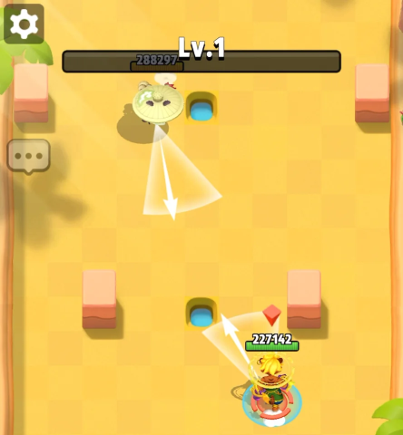

### 1.3.2 Poderes

En Chartarium Wars existen distintos poderes que los tanques podrán utilizar para beneficiarse en combate y adoptar distintas estrategias. Estos son los poderes que el jugador podrá usar y sus consecuencias:

* Poderes que modifican a los tanques:  
  * **Recuperar vida**: le otorga un punto de vida al jugador que lo recoja; si el jugador posee el máximo de vidas, el power-up no hará nada (desaparece igualmente y perjudica al rival porque no lo podrá recoger).  
  * **Más Veloz**: el tanque se mueve más rápido (x1.25 de velocidad).  
  * **Más lento**: el tanque rival se mueve más lento (x0.75 de velocidad).  
  * **Escudo**: evita, de manera temporal, la pérdida de 1 vida (solo bloquea 1 vida perdida).  
  * **Camuflaje** (solo online): desaparece el tanque en la pantalla del otro jugador por un periodo corto de tiempo (no es probable que se realice).  
* Poderes que modifican las balas:  
  * **No Fuego Amigo**: elimina la posibilidad de que las balas hagan daño al tanque que la disparó durante un tiempo.  
  * **Disparo en Rafaga**: el tanque lanza 3 balas en un periodo muy corto de tiempo.  
  * **Bala Fantasma:** la siguiente bala ahora puede atravesar muros.  
  * **Bala Veloz:** la siguiente bala ahora va más rápido y el apuntado es directo al enemigo.  
  * **Bala Explosiva:** la siguiente bala explota cuando es destruida.  
  * **Vampirismo**: si la siguiente bala golpea al rival, otorga 1 vida a quien la disparó.

### 1.3.3 Victoria

En Chartarium Wars, los jugadores tendrán como objetivo destruir el tanque contrario. Para ello el jugador deberá alcanzar con las balas al contrario un total de tres veces para conseguir la victoria. Aunque es posible conseguir la victoria de otra manera, si el tiempo se acaba, ganará el jugador que termine con más vidas, pero si ambos tienen la misma cantidad de vida, la partida terminará en empate.

## 1.4 Físicas

Para la realización de Chartarium Wars, es necesario tener en cuenta las físicas que se deben producir en este. El principal problema son las colisiones, pues supone la base del juego. Y también hay que tener en cuenta el movimiento pues se pueden emplear distintos tipos para conseguir efectos más realistas.

### 1.4.1 Colisiones

Respecto a las colisiones, hay dos grupos: las colisiones con el entorno y fuera de él. Dentro del entorno, se encuentran colisiones entre los tanques y las distintas partes del escenario, que impiden su avance. Además, hay colisiones con las balas, que hacen que estas reboten con el entorno un número determinado de veces, después se destruyen.

Las colisiones fuera del entorno son las que ocurren entre los tanques y las balas. Los tanques pueden colisionar entre ellos, si ocurre, entonces no se podrán mover pues se encuentran en el camino del otro. Las balas pueden colisionar también entre ellas, si esto pasara, se eliminarían ambas balas implicadas en la colisión. Por último y más importante, colisiones entre balas y tanques. Si se da esta colisión, la bala se destruiría y el tanque recibiría daño, pues ha sido alcanzado por una bala.

### 1.4.2 Movimiento

Los tanques pueden moverse en ocho direcciones y siempre se mueven con velocidad constante. Se deberá normalizar el movimiento diagonal ya que es muy común que este tipo  de movimiento sea más rápido que el resto. Las balas se disparan en la dirección de la torreta y con velocidad constante, pudiendo lanzarse estas en cualquier dirección.

## 1.5 Calidad del escenario

El escenario será una hoja de papel de cuadrícula, donde se delimitará el espacio de combate con muros alineados con la cuadrícula. Tanto los muros como el fondo estarán en blanco y negro, para que no destaquen demasiado. Dentro del campo de batalla habrán suficientes obstáculos con los que se podrán proteger los tanques. Además algunas explosiones podrían modificar el mapa, destruyendo muros y dando un aspecto diferente al mapa.

# 2. IMAGEN Y DISEÑO VISUAL

## 2.1 Estilo visual

El estilo visual elegido es el estilo papel, que destaca por ser muy llamativo y sencillo visualmente. Todos los objetos del juego serán dibujados en papel y escaneados para su uso en medio digital.

Los tanques tendrán colores para una mejor visualización, así como sus balas. Inicialmente se dispondrá de dos colores posibles, rojo y azul. Sin embargo, se pretende añadir los colores amarillo y verde en posteriores fases del desarrollo y dar la opción al jugador de elegir color. 

## 2.2 Bocetos

A continuación se muestran los primeros bocetos de los tanques, el logo del juego e interfaces.
 
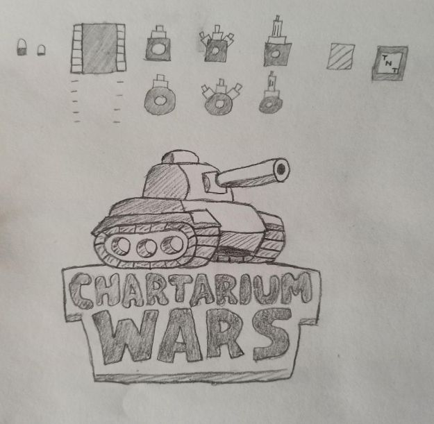
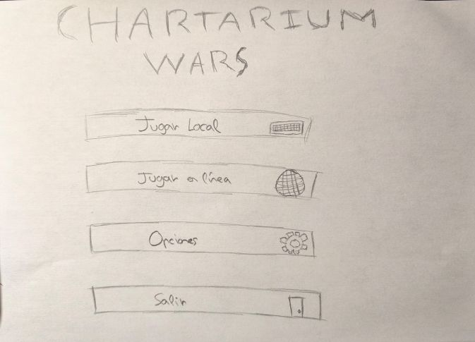
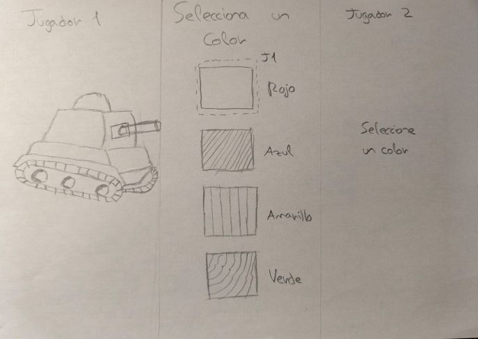
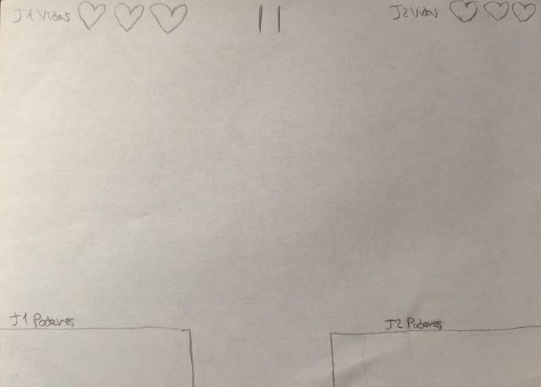

## 2.3 Logotipo

Se muestran los logotipos del juego y empresa ya escaneado.

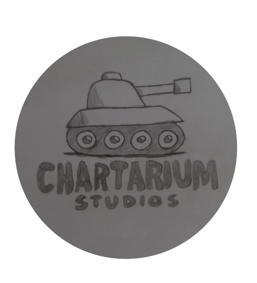
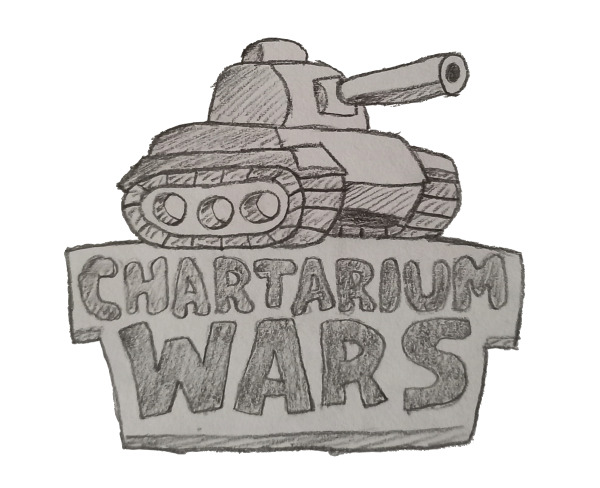

## 2.4 Inspiración

Hay juegos existentes que ya se basan en una mecánica de tanques. Estos sirven de inspiración tanto a nivel artístico como a nivel de jugabilidad. Ejemplos más destacados son Tanks Wii, Tiny Tanks, tinytanks.io y Paper Tanks.   
# 
Tanks Wii cuenta con un estilo más bélico y realista que los demás. Tiene modo un jugador y dos jugadores como se muestra en la imagen. No dispone de poderes, pero sí de varios enemigos de distintas clases que dan dificultad al juego.

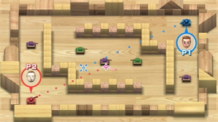
# 

Tiny Tanks está inspirado en el pixel art. La peculiaridad del juego es que tiene varios jefes como en la imagen, lo que aumenta su dificultad. Además, cuenta con varios poderes que se van eligiendo y son permanentes durante esa partida. Compensando así la gran dificultad del juego.

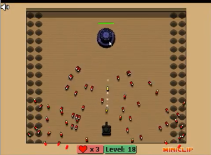
# 

Tinytanks.io es un juego mucho más minimalista. Usa colores azules para los aliados y rojos para los enemigos. Es un juego en línea con varias personas a la vez. Cuenta con distintos tipos de tanques que disparan balas diferentes. 

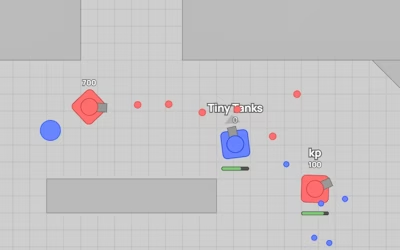
# 

Paper Tanks es un juego local con una temática muy característica. Todo ha sido dibujado a boli con una vista cenital, intentando simular 3D con el uso de sombras. No tiene poderes adicionales pero dispone de distintos enemigos cada uno con más vida que el anterior.

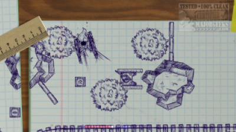

# 3. SONIDO

## 3.1 Música

La música será un estilo más retro arcade con música de 8 bits, intentando imitar las marchas militares con una percusión fuerte. Se realizará en alguno de los siguientes programas que facilitan la edición de música: Fl Studio y Beat Box.

## 3.2 Efectos sonoros

Los efectos de sonido se sacarán de diferentes librerías sin regalías, que puedan utilizarse en un juego gratuito, con su debido crédito. El tanque hará ruido cuando se mueva, habrá un sonido de cañón cuando se dispare una bala y cuando rebote y los distintos poderes tendrán distintos sonidos al recogerse.

# 4. NARRATIVA

## 4.1 Historia del Juego

En el extenso mundo de Chartarium, un vasto imperio de tierras divididas por tierras fértiles, desiertos infinitos y montañas imponentes, varias facciones compiten por el control absoluto del territorio y sus recursos estratégicamente. Este mundo evoca la grandeza de los antiguos imperios, donde honor, gloria y poder decidían la supervivencia de naciones enteras. 

Desde la Cuarta Gran Guerra de Chartarium, el estilo de guerra tradicional quedó obsoleto: los soldados fueron sustituidos por tanques de combate controlados remotamente, auténticas bestias metálicas alimentadas por energía avanzada y conectadas a sus generales mediante sistemas de enlace neuronal. Estos tanques son extremadamente caros de construir y cada unidad representa tanto la fuerza militar como la riqueza de su facción. 

Por ello, los enfrentamientos no son batallas masivas, sino duelos tácticos entre unos pocos tanques, donde cualquier triunfo o fracaso tiene repercusiones políticas, económicas y sociales. Los generales son los responsables de maquinar los tanques hacia la victoria, enfrentándose no solo al enemigo, sino también a la presión de honrar a sus propios pueblos y mantener en alto la reputación de su facción. Cada enfrentamiento recuerda a los combates de gladiadores en el coliseo; la habilidad, la valentía y la estrategia individual pueden cambiar el destino de imperios enteros.

Las facciones principales de Chartarium son:

* **Solarnis**: Gobernantes de las tierras fértiles del Valle de Aurum, los Solarnis combinan tradición imperial con tecnología de vanguardia. Sus tanques son obras maestras color amarillo dorado, alimentadas por reactores solares y adornadas con símbolos de linaje. Creen que la guerra es una extensión del arte y la diplomacia.  
    
* **Ignarok**: Originarios de los desiertos abrasadores del sur, los Ignarok son descendientes de tribus nómadas que se unieron tras la Cuarta Gran Guerra. Sus tanques son rojizos y robustos, resistentes al calor extremo y alimentados por núcleos de magma. Viven por el honor del combate directo.  
    
* **Virelia**: Una facción tecnocrática que domina las montañas del norte, donde se encuentran los laboratorios más avanzados de Chartarium. Los Virelia creen que la inteligencia es la única vía hacia el poder. Sus tanques son azules, rápidos, sigilosos y equipados con sistemas de camuflaje.  
    
* **Thar-Khaz**: Una facción ancestral que habita las ruinas volcánicas del oeste. Los Thar-Khaz veneran a los antiguos titanes de guerra y construyen sus tanques verdosos como si fueran criaturas mitológicas. Sus unidades son enormes, lentas pero devastadoras, decoradas con runas y partes de enemigos caídos.

## 4.2 Desarrollo de personajes

Los Generales de Chartarium no son solo unos simples comandantes de guerra: son líderes, estrategas y pilotos de élite, enlazados mentalmente con sus tanques a través de tecnología de última generación. Esta conexión los convierte en el cerebro y corazón de la máquina, entrelazando la astucia humana con la potencia mecánica.  
    
El honor y la reputación son igual de importantes como la victoria: un general con éxito aumenta su prestigio, poder político e influencia militar, mientras que una derrota puede significar la pérdida total del tanque, recursos desperdiciados y un gran daño a la reputación de su facción.

Cada general tiene su propia su propia historia y motivaciones:

* **Belisario** “El fantasma”: general de la facción Virelia caracterizado por sus movimientos impredecibles y su capacidad de esquivar balas como si de un fantasma se tratase. Su poder favorito es Bala Fantasma, con la que ha acabado con innumerables enemigos sin que puedan ver siquiera el tanque de Belisario.

* **Narsés** “El francotirador”: general de la facción Solarnis caracterizado por su gran visión y su puntería. Es capaz de usar Bala Veloz para destruir a sus enemigos desde la otra punta del mapa sin dar ninguna posibilidad de escapatoria. Dicen los rumores que una vez destruyó a dos enemigos con una sola bala.  
    
* **Cicerón** “La tormenta”: general de la facción Thar-Khaz caracterizado por su gran fuerza y estrategia. Con su poder favorito Disparo en Ráfaga ha destruido múltiples enemigos de un solo golpe. Siempre se las ingenia para acercarse a los enemigos y cuando se quieren dar cuenta, han perdido todas las vidas y la partida.  
    
* **Licinio** “El pirómano”: general de la facción Ignarok caracterizado por llenar el mapa de explosiones. Gracias a Bala Explosiva el campo se vuelve un lugar donde cada bala puede explotar causando una reacción en cadena que hace saltar a sus enemigos por los aires.

# 5. Comunicación

## 5.1 Marketing

El juego se subirá a las plataformas de itch.io y Newgrounds donde estarán disponibles al público y cualquier persona podrá jugarlo. En un futuro con nuevas actualizaciones se podrá subir a plataformas como Steam, Epic Games o incluso a plataformas de consola como Xbox, Playstation y Nintendo Switch.

Para dar a conocer Chartarium Wars, el equipo de desarrollo participa en eventos de videojuegos como Madrid In Game o IndieDevGames, entre otros. Además se publicarán anuncios para redes sociales, otros juegos que utilicen anuncios o páginas web de juegos online como Friv o Poki.

# 6. DIAGRAMA DE FLUJO

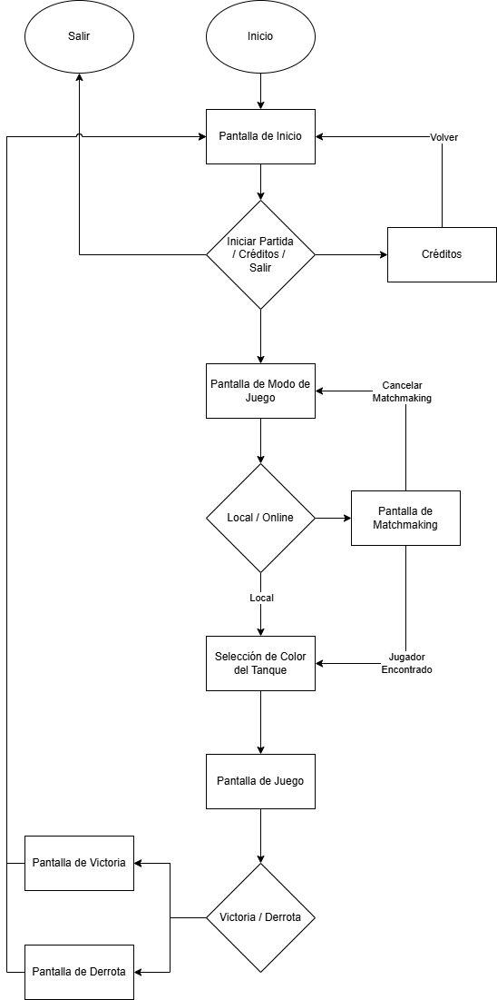

# 7. REFERENCIAS

[https://www.drawio.com](https://www.drawio.com) para realizar el diagrama de flujo  
[https://github.com/Mip0pim/Chartarium\_Wars](https://github.com/Mip0pim/Chartarium_Wars) repositorio de GitHub  
[Wii Play - Tanks - Missions 1-100 Complete](https://www.youtube.com/watch?v=orLxrg51xL8) Tanks Wii, video completo  
[https://armorgames.com/tiny-tanks-game/18063](https://armorgames.com/tiny-tanks-game/18063) Tiny Tanks(para jugar)  
[https://tinytanks.io/](https://tinytanks.io/)  tinytanks.io(para jugar)  
[https://chillnplay.itch.io/paper-tanks](https://chillnplay.itch.io/paper-tanks) Paper Tanks en itchio (para jugar)  
[https://play.google.com/store/apps/details?id=com.habby.archero\&hl=es\_419](https://play.google.com/store/apps/details?id=com.habby.archero&hl=es_419) Juego Archero  
[https://krita.org/es](https://krita.org/es) para editar dibujos

